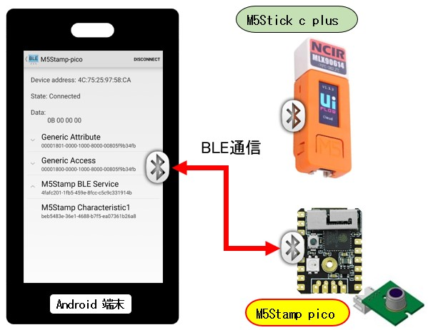

# M5Stack電子工作プログラミング & アプリ連携

## 開発環境の構築

### OS
- Ubuntu 22.04

### 統合IDE

- Visual Studio Code for Linux.
- Plugins:
  - PlatformIO IDE for VSCode
  - C/C++ (Microsoft)
  - C/C++ Extention Pack (Microsof)

>PlatformIO ドキュメンテーション

What is PlatformIO?  
<https://docs.platformio.org/en/stable/what-is-platformio.html>

PlatformIO IDE  
<https://docs.platformio.org/en/stable/integration/ide/pioide.html>


>M5Stack ドキュメンテーション

M5Stack Core ESP32  
<https://docs.platformio.org/en/stable/boards/espressif32/m5stack-core-esp32.html>

M5Stick-C  
<https://docs.platformio.org/en/stable/boards/espressif32/m5stick-c.html>


PlatformIO をインストールするとホームディレクトリ直下に作業ディレクトリが作成されます。  
- **~/.platformio**

このディレクトリの中に共通ライブラリがサンプルとともにダウンロードされます。  
- ~/.platformio/packages/**framework-arduinoespressif32**/libraries/

下記ディレクトリのサブディレクトリに **src** と **samples** ディレクトリがあります。  
インターネットを探す前にまずは下記ライブラリの中のサンプルから始めてみるのが良い思います。

```
[ライブラリディレクトリ一覧]
ArduinoOTA/
AsyncUDP/
BLE/
BluetoothSerial/
DNSServer/
EEPROM/
ESP32/
ESPmDNS/
Ethernet/
FFat/
FS/
HTTPClient/
HTTPUpdate/
HTTPUpdateServer/
I2S/
LittleFS/
NetBIOS/
Preferences/
RainMaker/
SD/
SD_MMC/
SPI/
SPIFFS/
SimpleBLE/
Ticker/
USB/
Update/
WebServer/
WiFi/
WiFiClientSecure/
WiFiProv/
Wire/
```

### このリポジトリのコンテンツURL

<https://pipito-yukio.github.io/m5stack_electronic_work/index.html>

### トピック

#### 01. M5Stamp picoのBLEライブラリを試す  

<div>

</div>

- [ソース] 01_M5StampBLE_android  
  M5Stamp pico のBLE通信 -  Androidアプリ連携サンプル

- ソース説明は下記URLからどうぞ  
 <https://pipito-yukio.github.io/m5stack_electronic_work/01_M5stamp_BLE_android.html>
